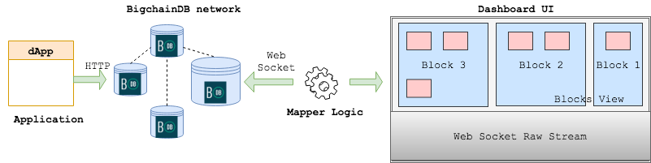

# BigchainDB Dashboard - High Level Design

This document defines the high level design for the BigchainDB dashboard.

## Tech Stack

The BigchainDB dashboard is a set of react components which can be packaged together and integrated with any existing react application.

## Solution Overview

The overall BigchainDB dashboard can be divided into the following high-level solution components,

### Data Source

The data source of the dashboard will be the web socket of a BigchainDB node. The web socket will provide a stream of data on creation of blocks in the BigchainDB network.

### Mapper

The mapper logic will map specific properties of the transaction assets into generic properties so that the whole solution can be reused across differnt dApps. Basically, this mapper will streamline the asset schemas.

### Dashboard UI

The dashboard UI will be divided into two parts - blocks view and web socket stream view.
